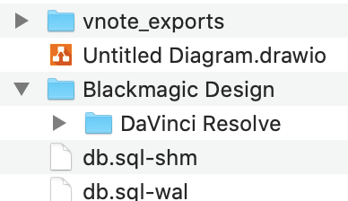
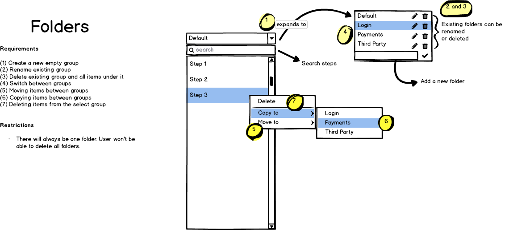

# folders

Many similar applications uses collections to group items together. A collection is visually represented in a tree view similar to what we see in file explorers.

In Orkestra, I'll try a different approach to keep it cleaner and simpler.
As such, it won't support nested folders and a user can only see the currently selected folder to improve focus and hide any unrelated items.

Here is an initial mockup of folders.

