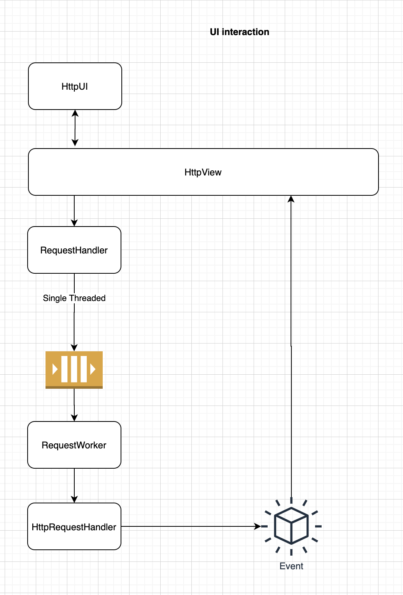

# UI Data flow and interaction between classes

As Orkestra supports multiple protocol types, we need to make sure that each protocol type can customise any part of the application.

## Protocol/Item specific classes
Protocol Type will be referred to as `ItemType` in the application source code. An ItemType can be `HTTP`, `SQL`, `GraphQL` etc

```
- <Item>Widget : The user-interface for handling a particular item type
    - <Item>TreeItemWidget : Display custom view in the tree list
    - <Item>RequestWidget : Collect request details required to run
    - <Item>ResponseWidget : Display response as appropriate for this <Item>

- <Item>View: A view class to get/set from the <Item>UI
    - <Item>RequestView
    - <Item>ResponseView

- <Item>Controller: A controller class to interact with item specific views

- <Item>RequestHandler: Response for processing the request from `RequestDelegator`
```

An example of UI interaction between different classes




## Common Classes

Along with the <Item> specific classes, we'll also have some common data structures (not limited to the following listed)

```
- OriginalRequest : Stores original request with variables
    - id : uuid
    - timestamp : DateTime
    - itemType : Enum
    - requestDetails : Dict

- ExchangeRequest : Stores request after substituting environment and context variables
    - id : uuid
    - timestamp : DateTime
    - itemType : Enum
    - requestDetails : Dict
    - originalRequestId : uuid

- ExchangeResponse : Stores response after the `ExchangeRequest` is processed
    - timestamp : DateTime
    - exchangeRequestId : uuid
    - responseDetails : Dict

- RequestHandler : Responsible for accepting the request from <Item>Controller and queueing it
- RequestWorker : Implements QThread or (QRunnable) and response for maintaining a single-threaded queue
- RequestDelegator : Responsible for delegate request based on the <Item> type
- DataStorage : Response for working with the database. It should abstract any lower level details so that it can be possible to change it if required
- DataAccess : Responsible for providing domain specific methods to apply CRUD operations on the storage layer
- DataCache : Responsible for caching all data in memory and providing pass-through cache updates to `DataAccess`
```